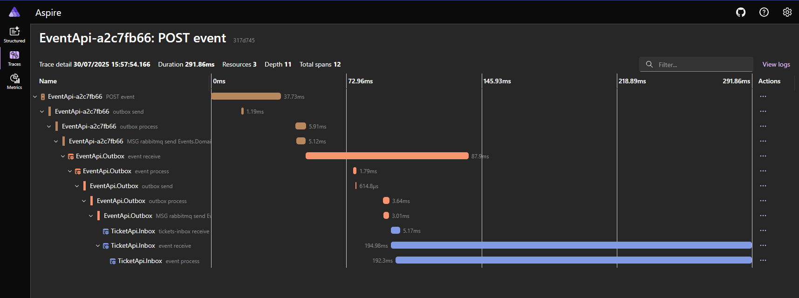

# Ticket Buddy
A simple ticket booking platform for events.

Built as both a modular monolith and as microservices to compare and contrast.

## Modular Monolith
Built in well-defined modules to be hosted as a single application. Services communicate through in-process calls.
A modular monolith is where a team should start when building a new application.

## Microservices
Built with a distributed architecture designed to run locally. Services communicate through asynchronous messages using MassTransit with RabbitMQ.
The aim is to demonstrate a fully observable and decoupled system.
Admittedly, the transactional outbox pattern is overkill.

Microservices are a good choice when the application is expected to grow significantly, or when different teams will work on different parts of the application.

These microservices are in one repo and one dotnet solution, but they can be split into multiple repositories and solutions if needed and referenced as NuGet packages.

## Key technologies/choices:
- ASP.NET Core
- Docker
- RabbitMQ (Microservices)
- MassTransit (Microservices)
- OpenTelemetry
- .NET Aspire
- Transactional Outbox Pattern (Microservices)

## Observability

Ticket Buddy uses OpenTelemetry to provide comprehensive observability across all services. 
The monolithic and distributed telemetry data are visualized in the Aspire dashboard.

